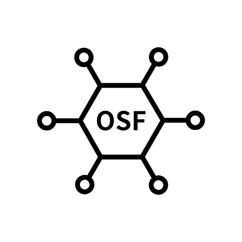

# Open Sensor Fusion

  

<!-- Organization logo asset: profile/assets/opensensorfusion-logo.png -->
<!-- If a vector logo is added later, prefer profile/assets/opensensorfusion-logo.svg. -->

Open Sensor Fusion Foundation is the public-facing project home for Open Sensor
Fusion, an open hardware and Linux IIO host support project for sensor
aggregation devices.

Open Sensor Fusion focuses on hardware documentation, firmware interface notes,
and Linux host-side documentation for OSF0 UART streams. The first concrete
hardware target is OSF GREEN.

## Repositories

- `opensensorfusion-hardware` - OSF GREEN hardware documentation and public
  release artifacts.
- `opensensorfusion-firmware` - firmware notes and target-specific interface
  documentation.
- `opensensorfusion-linux` - Linux IIO host-side driver work and OSF0 protocol
  documentation.

## Scope

- Sensor aggregation hardware targets.
- OSF0 UART stream documentation.
- Linux IIO host support documentation.
- Public hardware media, artifact locations, and project notes.

This profile describes the public project and community identity. It does not
make claims about legal entity status, product readiness, hardware readiness,
or kernel acceptance.
